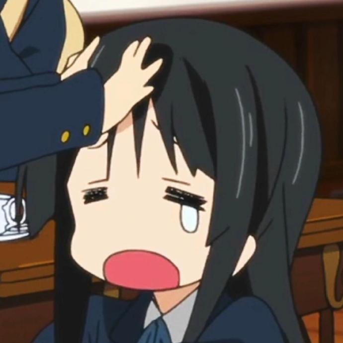
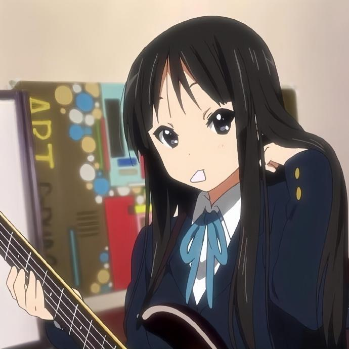

<!-- 打字机动画标题 -->

---

## 🍰 Self Introduction
Hello, I'm **Akiyama Mio**! I'm the bassist and part-time lyricist of **Ho-kago Tea Time (HTT)** in **K-ON!**. Normally, I'm a bit shy and scared of horror stories, but on the music and stage, I express my most sincere feelings through my playing. As a left-handed person, I like to practice holding a **Fender Jazz Bass**, humming the melody while incorporating daily thoughts into the lyrics.

I like cute things, but I feel shy when my friends compliment me on being cute. The most relaxing moments for me are when I'm brewing black tea and discussing new songs with my partners in the club activity room, or those few minutes before a performance when I'm secretly nervous yet eagerly anticipating.

---

## 🧁 Basic Information Card
- **Name**: Akiyama Mio
- **Club/Band**: Ho‑kago Tea Time, HTT
- **Role**: Bass (Left‑handed), Harmony, Lyricist
- **Musical instrument**: Fender Jazz Bass (left-handed)

---

## 📷 Photos

  
  
  

  
  

---

## 🎧 What I am doing 

-Practice new bass passes to make the rhythm more flexible.

-Write the daily life of the club into lyrics and prepare for the next live event.

-Learn recording and basic mixing to make the demo more like a 'finished product'.

-You can click the button below to access the songs I love on my Bandcamp homepage. My favorite album is [Look, a rainbow!](https://karaswalkhome.bandcamp.com/album/look-a-rainbow) from Kara's walk home.

  

